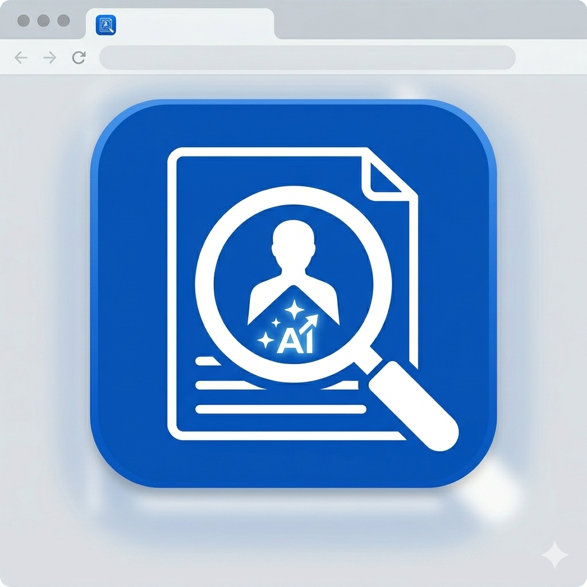

#  HireLens — AI-Powered Resume Intelligence


[](https://hirelens.puter.site)
[](https://puter.com)
[](https://hirelens.puter.site)

**HireLens** is a state-of-the-art, AI-driven resume analyzer designed to help job seekers bypass ATS filters and craft high-impact professional documents. It leverages advanced Large Language Models to provide deep, actionable feedback that goes beyond simple grammar checks.

---

## ✨ Key Features

- 🧠 **Deep Neural Analysis** — Goes beyond keywords to analyze the tone, impact, and logical flow of your resume.
- 🎯 **ATS Compatibility Score** — Simulates recruiter software to give you a real-time "pass/fail" rating.
- 💼 **Context-Aware Insights** — Add a target job description to get tailored suggestions for specific roles.
- ⚡ **Futuristic Dashboard** — A sleek, glassmorphism-inspired interface built for the modern professional.
- 🔐 **Cloud Privacy** — Powered by Puter.js, ensuring your data is stored securely in your personal cloud.

---

## 🛠️ Tech Stack & Ecosystem

| Category       | Technology                                                                                                                                      |
| :------------- | :---------------------------------------------------------------------------------------------------------------------------------------------- |
| **Core**       | [React Router v7](https://reactrouter.com/), [TypeScript](https://www.typescriptlang.org/)                                                      |
| **Styling**    | [Tailwind CSS v4](https://tailwindcss.com/) (Standard-shorthands)                                                                               |
| **AI/Cloud**   | [Puter.js SDK](https://puter.com/) (AI, Auth, KV, FS)                                                                                           |
| **Animation**  | [GSAP](https://greensock.com/gsap/) & [CSS Transitions](https://developer.mozilla.org/en-US/docs/Web/CSS/CSS_Transitions/Using_CSS_transitions) |
| **Typography** | [Outfit](https://fonts.google.com/specimen/Outfit) (Display) & [Plus Jakarta Sans](https://fonts.google.com/specimen/Plus+Jakarta+Sans) (Body)  |
| **Icons**      | [Lucide React](https://lucide.dev/), [Material Symbols](https://fonts.google.com/icons)                                                         |

---

## 🚀 Getting Started

To run HireLens locally, follow these steps:

### 1. Clone the repository

```bash
git clone https://github.com/sawaraunakk31/HireLens-AI-Resume-Analyzer.git
cd HireLens
```

### 2. Install Dependencies

```bash
npm install
```

### 3. Start Development Server

```bash
npm run dev
```

The app will be available at `http://localhost:5173`. Make sure you have the [Puter.js browser extension](https://puter.com/extension) or use the hosted version if required for cloud functionality.

---

## 📐 Architecture

HireLens is built with a **Cloud-Native** approach using Puter.js.

- **Frontend**: A highly optimized React application using React Router's new v7 architecture.
- **AI Middleware**: Direct integration with Puter's LLM endpoints, eliminating the need for a separate backend for inference.
- **Storage**: Uses Puter Key-Value store for resume history and Puter File System for PDF management.
- **Design System**: A custom CSS utility layer built on top of Tailwind CSS v4, focusing on glassmorphism, depth, and vibrant primary glows.

---

## 📸 Final UI Showcase

<div align="center">
  
  
</div>

---

## 📄 License & Credits

Built with ❤️ by **sawaraunakk31** for the futuristic workforce.

Special thanks to the **Puter.js** team for providing the powerful cloud-sdk that makes this possible.

---
